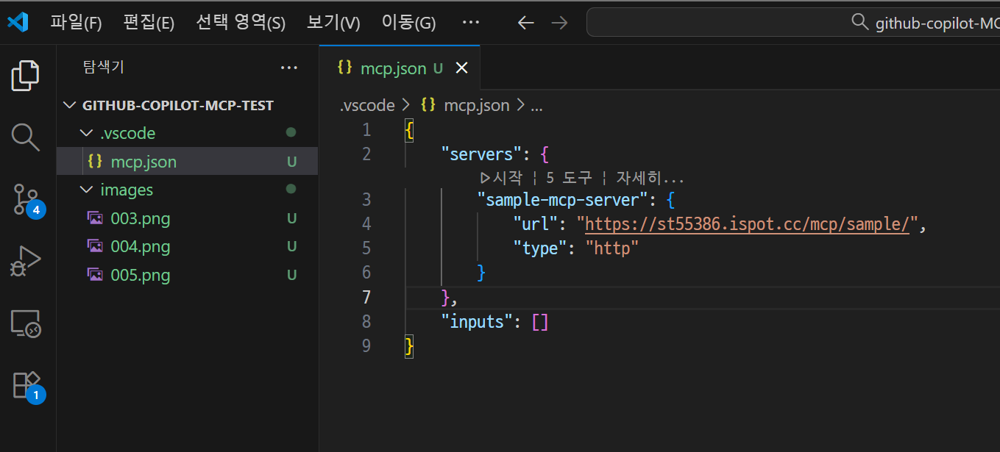
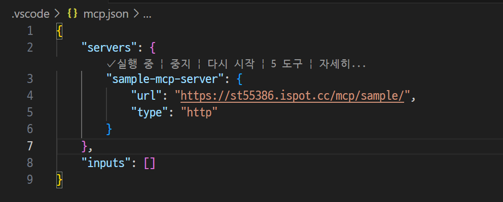
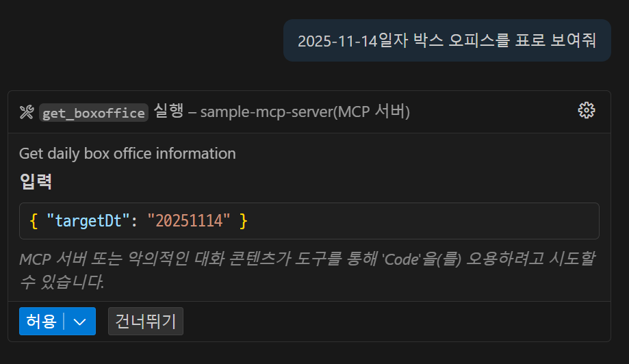
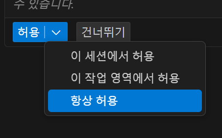
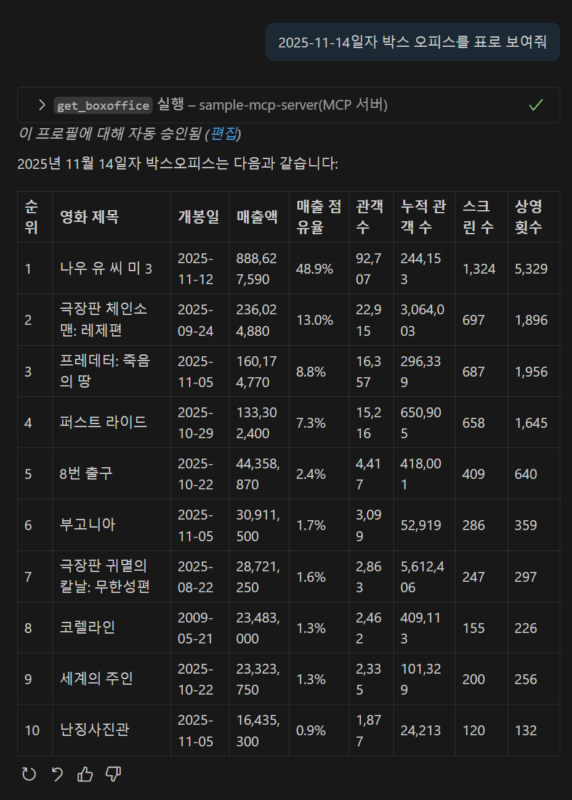
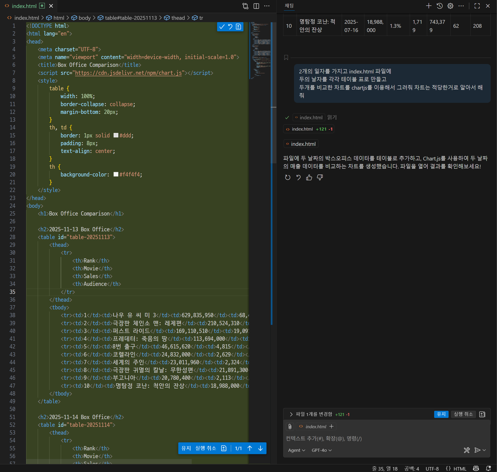

# 등록된 MCP SERVER 확인



# 등록된 MCP SERVER 시작



# GITHUB copilot 채팅창에 입력
```
2025-11-14일자 박스 오피스를 표로 보여줘
```


# 다음과 같은 권한 요구 에서 "항상허용"으로 적용



# GITHUB copilot 채팅창에 입력
```
2025-11-13일자 박스 오피스를 표로 보여줘
```



# index.html을 만들어 달라고 다음과 같이 요청
```
2개의 일자를 가지고 index.html 파일에
두의 날자를 각각 테이블 표로 만들고
두개를 비교한 차트를 chartjs를 이용해서 그려줘 차트는 적당한거로 알아서 해줘
```